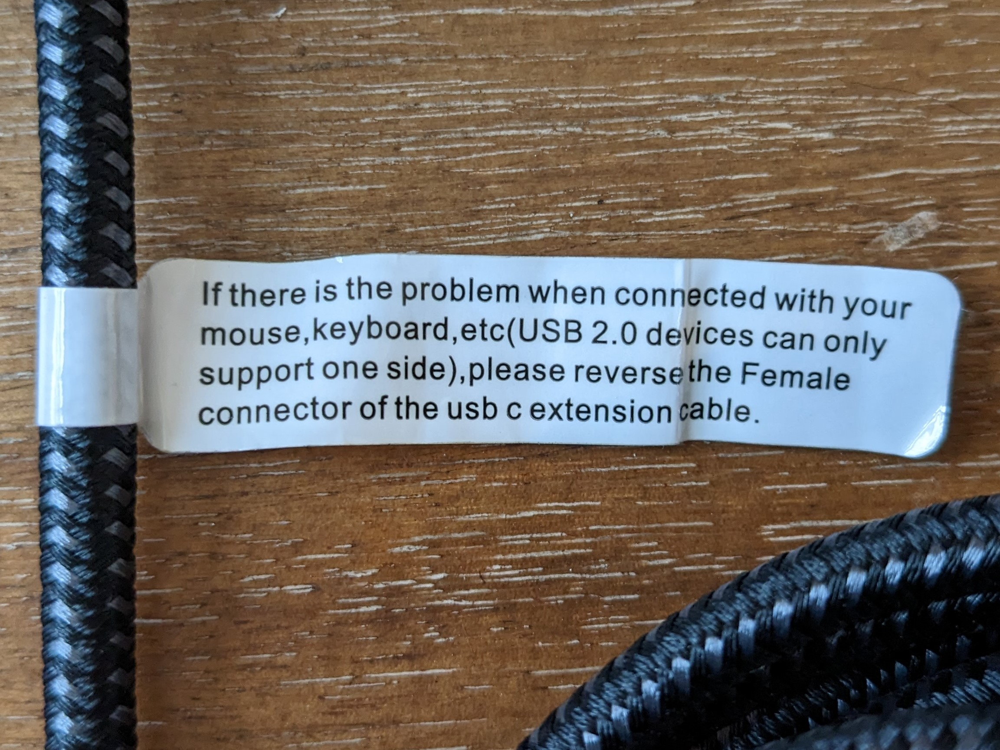
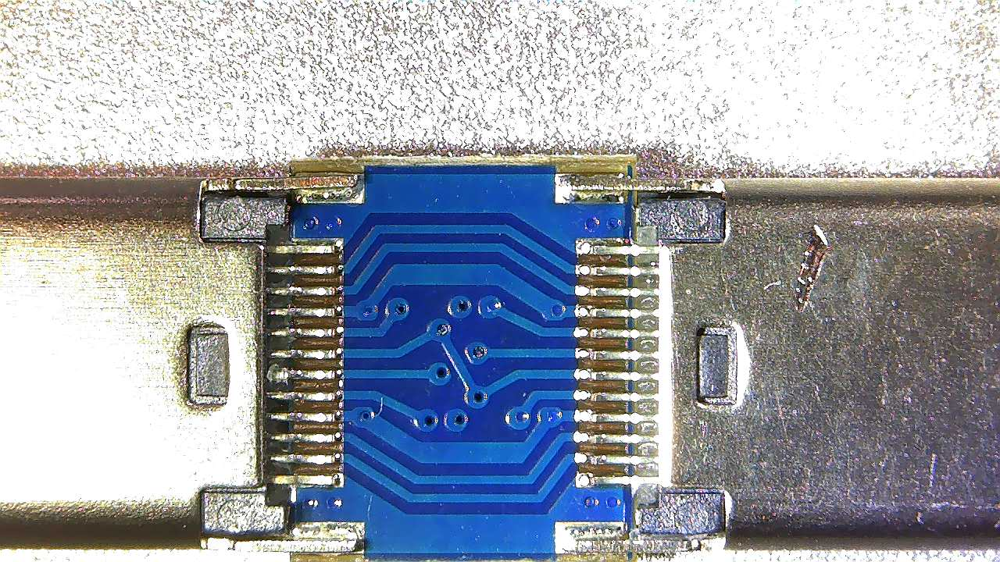
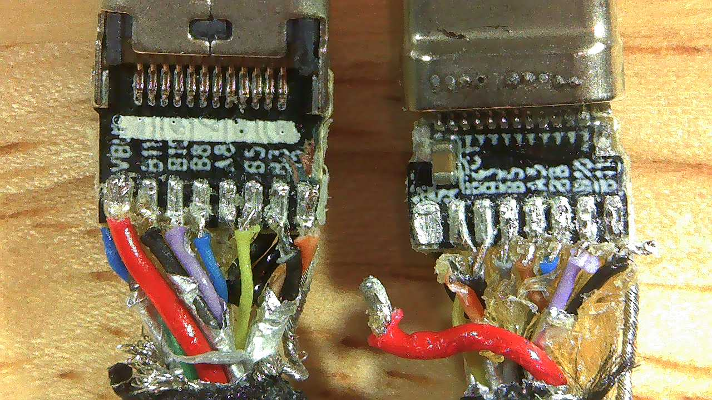

Quick reverse-engineering of USB-C coupler and USB-extension cables purchased on Amazon.

I would like to use USB-C cables in a non-compliant way for [another project](https://github.com/grahammedlin/USB-PD-Injector). 
I do not believe the [Type-C Specification](https://www.usb.org/document-library/usb-type-cr-cable-and-connector-specification-release-22) allows any passive configuration to use a Type C receptacle.
This seems to be because they could create composite 'cables' longer than guarantees about data integrity and power delivery allow.
Also, you could create a Type A-to-Type A cable and collapse the universe into a black hole.  

[//]: # (Comment)

But of course you can still buy them. 
If reusing a USB-C cable with only one CC wire or only one set of USB 2.0 pins, they come with an amusing tag like this:

## Teardown Photos

## References
- [Microchip "Introduction to USB Type-C" Appnote](http://ww1.microchip.com/downloads/en/appnotes/00001953a.pdf)
- [Hackaday "All About USB-C: Illegal Adapters"](https://hackaday.com/2022/12/27/all-about-usb-c-illegal-adapters/)
- [Stack Exchange "Why does a female-female coupler break the USB-C standard?"](https://electronics.stackexchange.com/questions/624904/why-does-a-female-female-coupler-break-the-usb-c-standard)
- [Type-C Specification](https://www.usb.org/document-library/usb-type-cr-cable-and-connector-specification-release-22)
>USB Type-C receptacle to USB legacy adapters are explicitly not defined or allowed. Such adapters would allow many invalid and potentially unsafe cable connections to be constructed by users.